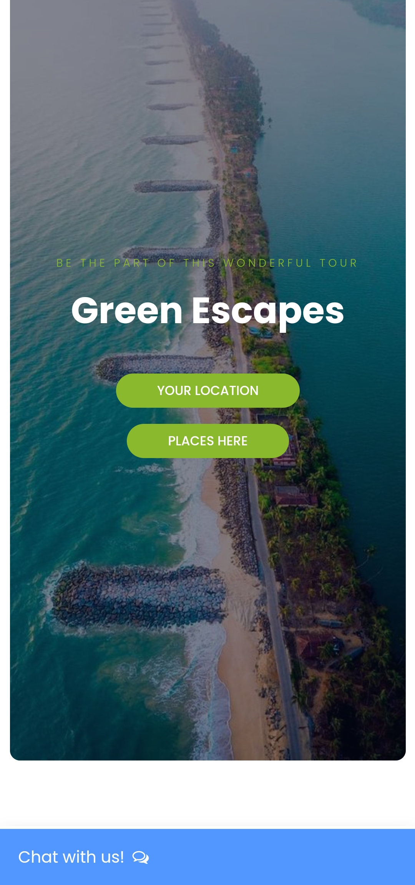
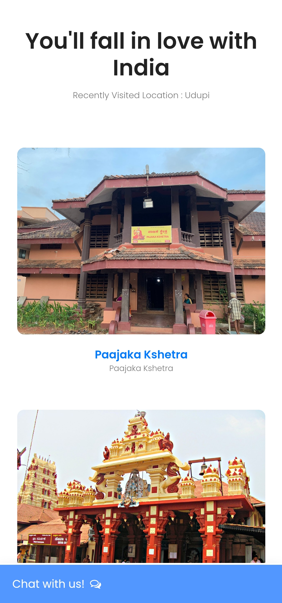
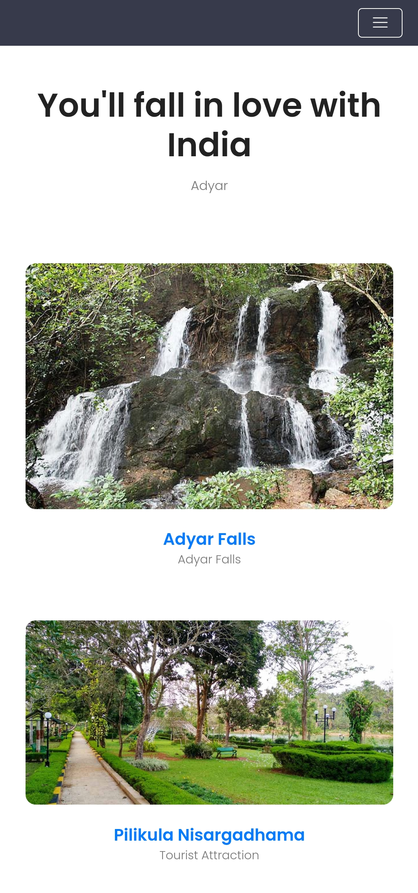

An web-application which has access to the NavIC System and help to discover new places.

## Appendix

- Help tourists visit much less known places around
- Gain knowledge of the localites and culture
- Just a prototype

## Screenshots

## Authors

- [@TejasNayak42](https://github.com/TejasNayak42)
- [@BhatNishanthGanesh](https://github.com/BhatNishanthGanesh)
